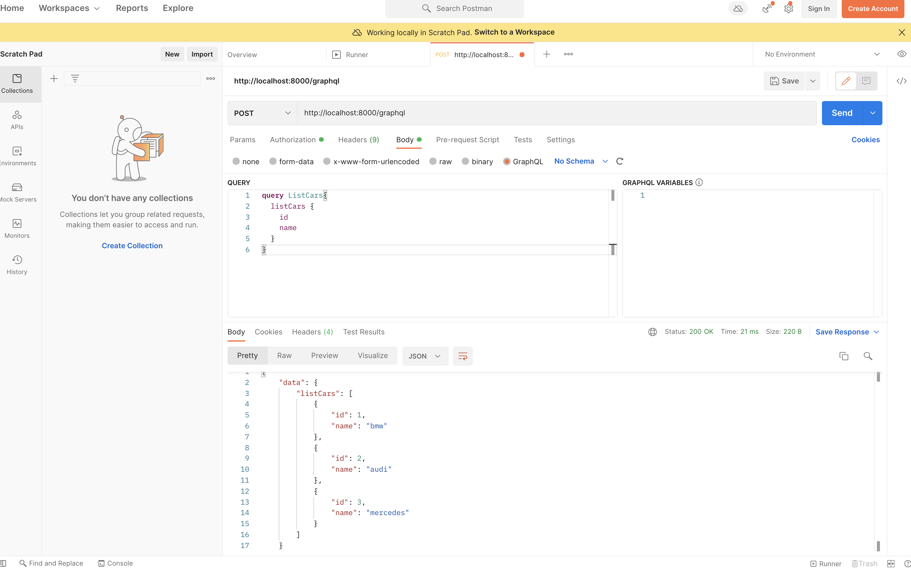

## GraphQl with Python FastAPI
Need to make a  python environment to install all of the required packages to run graphql and fast-api. We will use Orator ORM for the db chores.

## Technologies
* Python
* Fast API
* Graph-QL
* Orator
* psycopg2

## Directory Structure
```
.
├── config.py -> File to read environment variables from .env file
├── db.py -> Db connection
├── main.py -> Fast APIS
├── migrations -> Db Migrations
│   ├── 2022_05_31_110648_create_my_cars_table.py
│   └── __init__.py
├── models 
│   ├── __init__.py
│   └── my_car.py -> My Schema of Graphql
├── readme.md 
├── requirements.txt
├── schema.py -> Queries of GraphQL (Mutation, Query)
└── serializers.py -> Serializers of Model
```
## Environment Settings
Setting up environment
```bash
# Making conda environment
conda create -n graphql python=3.6

# Activating environment
conda activate graphql

# installing packages seperatly
pip install -r requirements.txt
pip install psycopg2-binary
```
Strawberry  is a new GraphQL library for Python 3, inspired by dataclasses.


# Story:
Why GraphQL?
(And why GraphQL over traditional REST?)

REST is the de-facto standard for building web APIs. With REST, you have multiple endpoints for each CRUD operation: GET, POST, PUT, DELETE. Data is gathered by accessing a number of endpoints.

For example, if you wanted to get a particular user's profile info along with their posts and relevant comments, you would need to call four different endpoints:

```
/users/<id> returns the initial user data
/users/<id>/posts returns all posts for a given user
/users/<post_id>/comments returns a list of comments per post
/users/<id>/comments returns a list of comments per user
```
This can result in request overfetching since you'll probably have to get much more data than you need.

Moreover, since one client may have much different needs than other clients, request overfetching and underfetching are common with REST.

GraphQL, meanwhile, is a query language for retrieving data from an API. Instead of having multiple endpoints, GraphQL is structured around a single endpoint whose return value is dependent on what the client wants instead of what the endpoint returns.

In GraphQL, you would structure a query like so to obtain a user's profile, posts, and comments:

```json
query {
  User(userId: 2){
    name
    posts {
      title
      comments {
        body
      }
    }
    comments {
      body
    }
  }
}
```
Voila! You get all the data in just one request with no overfetching since we specified exactly what we want.


## Setting Database
Make a ```.env``` file with in the project directory.
```
# ENV FILE
DATABASE_HOSTNAME='localhost'
DATABASE_PORT='5432'
DATABASE_PASSWORD='postgres'
DATABASE_NAME='graphql'
DATABASE_USERNAME='postgres'
DATABASE_DRIVER='postgres'
```

### Postgres Structure


```bash
# Run on terminal (After activating environment)
# Making a migration file
orator make:model MyCar -m

>>> Model MyCar successfully created.
>>> Created migration: 2022_05_31_110648_create_my_cars_table.py
```
a new migration file will be created in your project folder ```migrations/2022_05_31_110648_create_my_cars_table.py``` with code

```python
from orator.migrations import Migration


class CreateMyCarsTable(Migration):

    def up(self):
        """
        Run the migrations.
        """
        with self.schema.create('my_cars') as table:
            table.increments('id')
            table.timestamps()
            
            

    def down(self):
        """
        Revert the migrations.
        """
        self.schema.drop('my_cars')

```
now I also need a name field in the table so I will add ```table.string('name')``` in up function

**File After Changing**

```python
from orator.migrations import Migration


class CreateMyCarsTable(Migration):

    def up(self):
        """
        Run the migrations.
        """
        with self.schema.create('my_cars') as table:
            table.increments('id')
            table.string('name')
            table.timestamps()
            
            

    def down(self):
        """
        Revert the migrations.
        """
        self.schema.drop('my_cars')

```

Now Lets run migration

```bash
orator migrate -c db.py


>>> Are you sure you want to proceed with the migration?  (yes/no) [no] yes
>>> Migration table created successfully
>>> [OK] Migrated 2022_05_31_110648_create_my_cars_table
```
Now if you view your db now their is another Table name ```my_cars```

After running the code:
```bash
# run this on terminal to start application
uvicorn main:app --reload
```

open this url in browser ```http://localhost:8000/graphql```

```json
mutation createMyCar{
  createMyCar(
    carDetails: {
      id: 1,
      name: "bmw"
    }
  ) {
    id
    name
  }
}
```

Query your db from pg_admin or admin


## Now lets fetch the cars

Go to url ```http://localhost:8000/graphql```
```json
query ListCars{
  listCars {
    id
  	name
  }
}
```
**Results:**
```json
{
  "data": {
    "listCars": [
      {
        "id": 1,
        "name": "bmw"
      },
      {
        "id": 2,
        "name": "audi"
      }
    ]
  }
}
```


## Graphql Results
